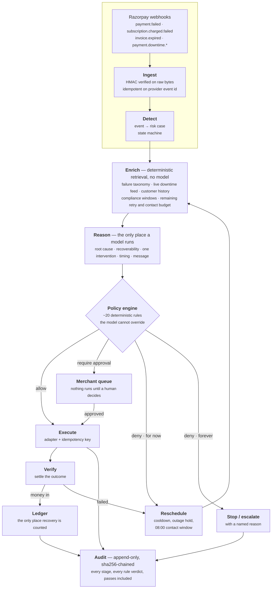

# Munshi

**A bounded revenue-recovery agent for Razorpay merchants.** It ingests payment
failures, subscription charge failures, overdue invoices and abandoned checkouts;
diagnoses each one against Razorpay's published failure taxonomy and live
downtime feed; picks one intervention; runs it through a deterministic policy
engine it cannot argue with; executes what survives; verifies the outcome; and
stops, with a reason, when it should.

*Razorpay AI Buildathon 2026 · Track 03: AI Revenue Recovery*

> **Every rupee in this repository is simulated.** Money movement runs against a
> deterministic outcome oracle seeded per case; no real payment rail is
> contacted. The Razorpay adapter performs real test-mode calls where test mode
> genuinely supports them and *refuses* the ones it cannot — see
> [What is real and what is simulated](#what-is-real-and-what-is-simulated).

---

## The one thing this is built on

A fixed retry ladder treats every failed payment the same. Razorpay does not: it
returns an `error_source` (`customer` / `business` / `gateway` / `razorpay`) and
an `error_reason` from a closed vocabulary on every failure, and documents, for
each one, who has to act.

Run that taxonomy over the demo book:

> **67 of 224 cases carrying a Razorpay failure code — 29.91% of them, and 35.94%
> of failed value (₹50,61,436) — are *structurally unretryable*.** The card has
> expired, the mandate is gone, the request is malformed, a risk engine declined
> it, or the customer has already paid. No retry ladder can collect any of it.

A ladder spends attempts on all of it anyway. Munshi spends zero.

## What that costs, and what it buys

320 cases · ₹1,83,20,352 at risk · 14-day recovery window · identical cases, identical
latent truth, identical per-case seeds in every arm.

| | Fixed retry ladder | **Munshi, unattended** | **Munshi + merchant approvals** |
|---|---:|---:|---:|
| Revenue recovered | ₹81,21,139 | ₹30,72,847 | ₹74,54,560 |
| Recovery rate | 44.33% | 16.77% | 40.69% |
| Held for a human to decide | ₹0 | ₹78,02,678 | ₹0 |
| Actions executed | 1,048 | 850 | 944 |
| Retries spent | 486 | 238 | 255 |
| **Retries with zero possible yield** | **201 (41.4%)** | **0** | **0** |
| **Customers chased after they had paid** | **15** | **0** | **0** |
| **Opted-out customers contacted** | **18** | **0** | **0** |
| **RBI / NPCI window violations** | **238** | **0** | **0** |
| Intervention accuracy | 66.6% | **87.2%** | **87.2%** |
| Diagnosis accuracy | 0% (it does not diagnose) | **89.4%** | **89.4%** |

**The ladder recovers more gross revenue, and that is reported rather than tuned
away.** It buys those extra rupees with 201 retries that could never have
succeeded, 15 messages to customers who had already paid, 18 to people who had
opted out, and 238 breaches of the RBI contact window. Munshi collects 92% of the
ladder's gross with half the retries and none of that.

The unattended figure is reported separately because **₹78L legitimately sits
behind a decision the agent will not make alone** — re-presentments above the
merchant's ceiling, collections escalations, and anything that changes what the
merchant is owed. The queue is the product, not a shortfall.

Full report: **[evaluation/report.md](evaluation/report.md)** · raw figures:
[evaluation/results.json](evaluation/results.json).

---

## Run it

Nothing needs a credential. With no `ANTHROPIC_API_KEY` the agent runs its
deterministic reasoner and says so in the header; with no Razorpay keys it runs
the simulator and says so too.

```bash
make install && make demo
```

Then open <http://127.0.0.1:8000>, paste the API token the server prints into the
header field, and press **Run recovery batch**.

<details>
<summary>Without make</summary>

```bash
pip install -e ".[dev]" && (cd web && npm ci && npm run build)
python -m munshi.seed.load
MUNSHI_API_TOKEN=demo-token uvicorn munshi.api:app --port 8000
```
</details>

```bash
make test   # 94 tests
make eval   # regenerates evaluation/report.md and results.json
make lint   # ruff + tsc
```

Docker: `docker build -t munshi . && docker run -p 8000:8000 munshi`.

---

## How it works



The three layers are separated on purpose, and the separation is the design:

| Layer | What it decides | Implementation |
|---|---|---|
| **Taxonomy + enrichment** | What a failure *means*, and whether a retry could ever work | Lookup over 65 Razorpay reason codes. No model. |
| **Reasoning** | Root cause when the code is ambiguous, which intervention, when, what to say | Claude, structured output, closed vocabulary |
| **Policy + execution** | What is actually permitted, and what runs | Deterministic rules. No model, no override. |

## Where the AI is — and where it deliberately is not

The model earns its place on three things, all of which are judgement over
heterogeneous evidence rather than lookup:

1. **Disambiguating opaque failures.** Razorpay documents `payment_failed` as
   *"no specific error code received from gateway"*. Whether a particular
   ₹84,000 decline is an outage, a balance problem or a dying card is a weighing
   of downtime state, customer history, amount and timing.
2. **Choosing between defensible interventions and their timing.** "Retry at
   20:00 because this payer has settled at 20:00 eleven times" versus "send an
   instrument-update link now" is a trade-off across signals that do not reduce
   to one ordering.
3. **Writing the customer message** — in register, citing the real reason and
   the real amount, without a template's tell.

It does **not** decide retryability (taxonomy), enforce limits (policy engine),
compute money (integer arithmetic on paise), or execute anything. Every field it
returns is re-validated against a closed vocabulary: a schema-shaped response is
still an untrusted response. Anything malformed **degrades to the deterministic
reasoner and is stamped as degraded** — the whole product runs, correctly, with
no API key at all. That fallback is also reported as its own evaluation arm, so
"is the model earning its cost?" is a question with a number attached rather than
an assumption.

## Bounded autonomy

Every action carries a tier. The tier is a property of the action, not something
a model argues for.

| Tier | | Actions |
|---|---|---|
| **L0** | Observe — never reaches a customer or moves money | `no_action`, `suppress_case` |
| **L1** | Recommend — surfaced, never auto-executed | *(none currently)* |
| **L2** | Autonomous — inside every limit below | `retry_payment`, `send_recovery_link`, `send_instrument_update_link`, `send_mandate_reauth_link`, `send_reminder`, `escalate_to_merchant_ops`, `open_engineering_ticket` |
| **L3** | Merchant approval required | `offer_partial_payment`, `issue_discount`, `escalate_to_collections` |
| **L4** | The agent may never execute this, with or without approval | `write_off` |

`write_off` is L4 because writing revenue off has tax consequences. No autonomy
tier makes that an agent's call.

**Stopping rules**, all enforced deterministically: 3 retries and 3 messages per
case; 6h between retries and 20h between messages, floored by the failure's own
documented backoff; a 14-day recovery window; a ₹2,00,000 autonomous
re-presentment ceiling; a ₹2Cr per-run circuit breaker on distinct value in
flight; a live-outage hold capped at 3 waits; customer opt-out; promise-to-pay
holds; and a hard stop on anything a risk engine declined.

A budget bounds an *avenue*, not the case: a customer who has had three messages
may still have a retry left, and closing the case there writes off collectable
revenue.

## The compliance envelope

Three published rule sets bound *when* an automated system may chase money in
India. They are encoded as deterministic checks, not left to a model's judgement.

- **RBI Fair Practices Code** — customer contact only 08:00–19:00 local, across
  every channel. An automated SMS at 02:00 is a violation in its own right, not a
  lesser offence than a phone call.
- **RBI Digital Payments E-mandate Framework (2026)** — a pre-debit notification
  at least 24 hours before every scheduled debit; AFA-free ceiling ₹15,000
  (₹1,00,000 for mutual funds, insurance and credit-card bills). Above it, only
  the customer can re-authenticate, so the agent cannot present the debit at all.
- **NPCI non-peak auto-debit windows** — before 10:00, 13:00–17:00, after 21:30.

Implemented from published guidance and exposed as configuration. Not legal
advice.

## What is real and what is simulated

Being precise about this is the point of the project.

| | Status |
|---|---|
| Razorpay failure taxonomy, 65 reason codes | **Real** — distilled from Razorpay's public error documentation |
| Payment Downtime entity shape, severities, statuses | **Real** — matches the documented entity |
| Webhook signature verification (HMAC-SHA256 over raw bytes) | **Real**, tested |
| Payment-link creation, payment fetch, downtime fetch | **Real Razorpay test-mode calls** when `MUNSHI_ADAPTER=razorpay_test` and test keys are set |
| Re-presenting a failed charge | **Refused, not faked.** It needs a customer-authorised mandate token that test mode cannot mint, so the adapter raises `UnsupportedInTestMode` and the executor records the action as *not executed* with that reason |
| Whether a payment succeeded | **Simulated** by a deterministic, per-case-seeded oracle |
| The 320-case book | **Synthetic**, generated from a fixed seed |
| Recovered rupees | **Simulated**, and only ever counted from a ledger row pointing at the causing action |

The dashboard states the active reasoner and adapter, and whether money movement
is simulated, in the header — next to the button that produces it.

## Measuring recovery honestly

Three properties make the numbers worth reading:

1. **A rupee counts as recovered only if it has a ledger row** pointing at the
   action that caused it. `_record_recovery` is the only function that can move
   the recovered total. There is no estimated recovery anywhere in the codebase.
2. **Outcomes resolve against hidden ground truth, not against the agent's
   opinion.** Every case carries a `latent` record — whether the money was ever
   recoverable, when the payer's balance really tops up, whether the customer
   would really replace a dead card, when the outage really clears. The agent
   never sees it (asserted by a test that greps the whole context pack and the
   whole API response for every latent field name). The oracle never sees the
   agent's reasoning. An agent cannot talk its way into a recovery.
3. **Luck is fixed per (case, action, attempt).** Both arms draw identical luck
   on identical cases. Only the choice of action and its timing differ, which is
   exactly the counterfactual being measured.

The oracle's conditional probability table is stated in
[`munshi/adapters/simulator.py`](munshi/adapters/simulator.py), derived from each
family's documented resolution condition — and it is *generous* to retries once
the precondition is met, which flatters the ladder, not Munshi.

## Repository

```
munshi/
  taxonomy.py        65 Razorpay reason codes → recovery semantics
  compliance.py      RBI FPC / e-mandate / NPCI windows
  downtime.py        Payment Downtime correlation
  enrich.py          the context pack a decision is made from
  reason.py          Claude reasoner + deterministic twin
  policy.py          ~20 deterministic rules; the model cannot reach it
  orchestrator.py    the closed loop over a virtual recovery window
  audit.py           sha256-chained, tamper-evident trail
  adapters/          simulator (outcome oracle) · razorpay_test (real calls)
  evaluation/        baseline ladder · metrics · harness
  seed/              deterministic 320-case batch with latent ground truth
  api.py             FastAPI, bearer-token writes, HMAC webhook
web/                 Vite + React + TS recovery desk
tests/               94 tests, incl. dangerous-autonomous-behaviour suite
docs/                architecture · agent design · policy · evaluation · security · demo
```

## Documentation

- [Architecture](docs/architecture.md) — the loop, the layers, the data model
- [Agent design](docs/agent-design.md) — where the model runs and what constrains it
- [Recovery policy](docs/recovery-policy.md) — every rule, tier and stopping condition
- [Evaluation](docs/evaluation.md) — method, arms, metric definitions, threats to validity
- [Security](docs/security.md) — authn, HMAC, idempotency, financial bounds
- [Demo script](docs/demo-script.md) — the five-minute run
- [Submission](docs/submission.md) — buildathon answers and pitch

## License

MIT — see [LICENSE](LICENSE).
