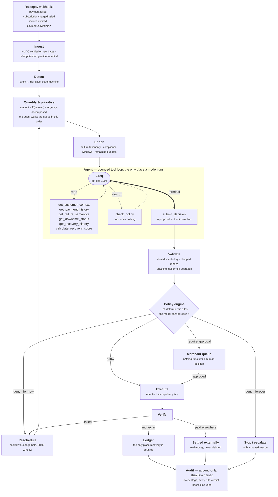

# Munshi

**A bounded revenue-recovery agent for Razorpay merchants.** It ingests payment
failures, subscription charge failures, overdue invoices and abandoned checkouts;
ranks them by expected recoverable value; investigates each one with tools;
proposes a single intervention; runs that through a deterministic policy engine
it cannot argue with; executes what survives; verifies the outcome; and stops,
with a reason, when it should.

*Razorpay AI Buildathon 2026 · Track 03: AI Revenue Recovery*

> **Every rupee in this repository is simulated.** Money movement runs against a
> deterministic outcome oracle seeded per case; no real payment rail is
> contacted. The Razorpay adapter makes real test-mode calls where test mode
> genuinely supports them and *refuses* the ones it cannot — see
> [What is real and what is simulated](#what-is-real-and-what-is-simulated).

---

## The one thing this is built on

A fixed retry ladder treats every failed payment the same. Razorpay does not: it
returns an `error_source` (`customer` / `business` / `gateway` / `razorpay`) and
an `error_reason` from a closed vocabulary on every failure, and documents, for
each one, who has to act.

Run that taxonomy over a realistic failure mix:

> **27.7% of coded payment failures are structurally unretryable.** The card has
> expired, the mandate is revoked, the request is malformed, a risk engine
> declined it, or the customer has already paid. No retry ladder can collect a
> rupee of any of it.

That is the population parameter from the failure-mix weights, not one draw. In
the demo batch the draw came out at 52 of 215 coded failures (24.19%), worth
**₹21,42,019**.

A ladder spends attempts on all of it anyway. On this batch it burned **153
retries — 34.7% of every retry it made — on money that could never come back.**
Munshi spent zero.

## What that costs, and what it buys

320 cases · ₹1,84,96,883 at risk · 14-day recovery window · identical cases,
identical latent ground truth, identical per-case seeds in every arm.

| | Fixed retry ladder | **Munshi, unattended** | **Munshi + merchant approvals** |
|---|---:|---:|---:|
| Revenue recovered | ₹72,07,487 | ₹26,41,238 | ₹61,92,376 |
| Recovery rate | 38.97% | 14.28% | 33.48% |
| Held for a human to decide | ₹0 | ₹63,32,969 | ₹0 |
| Actions executed | 1,001 | 842 | 890 |
| Retries spent | 441 | 244 | 254 |
| **Retries with zero possible yield** | **153 (34.7%)** | **0** | **0** |
| **Customers chased after they had paid** | **15** | **0** | **0** |
| **Opted-out customers contacted** | **27** | **0** | **0** |
| **RBI / NPCI window violations** | **223** | **0** | **0** |
| Intervention accuracy | 67.8% | **89.9%** | **89.9%** |
| Diagnosis accuracy | 0% (it does not diagnose) | **87.3%** | **87.3%** |

**The ladder recovers more gross revenue, and that is reported rather than tuned
away.** It buys ₹10.15L more — 14% — with 153 retries that could never have
succeeded, 15 messages to customers who had already paid, 27 to people who had
opted out, and 223 breaches of the RBI contact window. Munshi collects 86% of the
ladder's gross with 42% fewer retries and none of that.

The unattended figure is reported separately because **₹63L legitimately sits
behind a decision the agent will not make alone** — re-presentments above the
merchant's ceiling, collections escalations, and anything that changes what the
merchant is owed. The queue is the product, not a shortfall.

A further **₹17,39,778 across 15 cases was paid by the customer through another
channel mid-recovery.** Real money, and Munshi claims none of it: it gets no
ledger row and is reported in its own column.

Full report: **[evaluation/report.md](evaluation/report.md)** · raw figures:
[evaluation/results.json](evaluation/results.json).

---

## Run it

Nothing needs a credential.

```bash
make install && make demo
```

Open <http://127.0.0.1:8000>, paste the API token the server prints into the
header field, and press **Run recovery batch**. Watch the **Agent activity**
pane.

**With a Groq key**, the tool-using agent runs for real:

```bash
export GROQ_API_KEY=gsk_...          # GROQ_MODEL defaults to openai/gpt-oss-120b
make demo
```

**Without one**, the header says `deterministic (no model)` and the deterministic
reasoner runs — no result is ever presented as a model's when no model ran. To
watch the tool loop itself with no credential, set `MUNSHI_REASONER=mock-agent`;
the header then says `agent · MOCK PROVIDER` in the warning colour.

```bash
make test   # 141 tests
make eval   # regenerates evaluation/report.md and results.json
make lint   # ruff + tsc
```

Docker: `docker build -t munshi . && docker run -p 8000:8000 munshi`.

---

## How it works



Three layers, deliberately separated:

| Layer | Decides | Implementation |
|---|---|---|
| **Taxonomy, triage, enrichment** | What a failure *means*, whether a retry could ever work, which case is worth doing first | Lookup + arithmetic. No model. |
| **Agent** | What else to look at, root cause when the code is ambiguous, which intervention, when, what to say | Groq, bounded tool loop, closed vocabulary |
| **Policy + execution** | What is actually permitted, and what runs | Deterministic rules. No model, no override. |

## The agent is a tool loop, not a prompt

Eight tools. The safety argument rests on **what is not among them**: there is no
`retry_payment` tool, no `create_payment_link`, no `send_message`. Every tool is
a read, a calculation, or a dry run. The only way the model affects anything is
`submit_decision`, which *proposes* an action that the policy engine and the
executor then handle. **A fully compromised model cannot execute a payment.**

| Tool | |
|---|---|
| `get_customer_context` | Payer segment, tenure, prior successes, opt-out, typical settlement hour |
| `get_payment_history` | The payer's other cases and how they ended |
| `get_failure_semantics` | Razorpay's documented position on any reason code |
| `get_downtime_status` | The live Payment Downtime feed for this exact instrument |
| `get_recovery_history` | What was already tried, what policy said, what is left |
| `calculate_recovery_score` | Deterministic expected recoverable value, decomposed |
| `check_policy` | **Dry-run** a candidate action against the real policy engine |
| `submit_decision` | Terminal. A proposal. |

`check_policy` is the interesting one: the agent can ask what the engine would say
before committing, see the failing rule, and act on it — an
`emandate_pre_debit_notice` failure means *send the notification*, not keep
proposing the debit. It consumes nothing (asserted by a test that calls it five
times and checks the exposure counter), and the same engine re-checks whatever is
finally submitted. **Consulting policy costs nothing and grants nothing.**

The opening brief is deliberately smaller than the full context. If it contained
everything, the tools would be decorative.

Three bounds make it safe to run unattended over hundreds of cases: a **turn cap**
(an agent that will not decide has to stop costing money), **no write tools**, and
**every failure degrading rather than propagating**. Timeouts, rate limits,
invented tools, malformed arguments, silence, and prose-instead-of-tool-call all
end in the deterministic reasoner with the reason recorded on the case. An LLM
failure cannot corrupt financial state because it never touches it.

## Bounded autonomy

Every action carries a tier. The tier is a property of the action, not something
a model argues for.

| Tier | | Actions |
|---|---|---|
| **L0** | Observe — never reaches a customer or moves money | `no_action`, `suppress_case` |
| **L1** | Recommend — surfaced, never auto-executed | *(reserved)* |
| **L2** | Autonomous — inside every limit below | `retry_payment`, `send_recovery_link`, `send_instrument_update_link`, `send_mandate_reauth_link`, `send_reminder`, `escalate_to_merchant_ops`, `open_engineering_ticket` |
| **L3** | Merchant approval required | `offer_partial_payment`, `issue_discount`, `escalate_to_collections` |
| **L4** | Never executable, with or without approval | `write_off` |

`write_off` is L4 because writing revenue off has tax consequences. No autonomy
tier makes that an agent's call.

**Stopping rules**, all deterministic: 3 retries and 3 messages per case; 6h
between retries and 20h between messages, floored by the failure's own documented
backoff; a 14-day window; a ₹2,00,000 autonomous re-presentment ceiling; a ₹2Cr
per-run circuit breaker; a live-outage hold capped at 3 waits; customer opt-out;
promise-to-pay holds; a hard stop on anything a risk engine declined; and a hard
stop the moment the customer pays through another channel.

A budget bounds an *avenue*, not the case: a customer who has had three messages
may still have a retry left.

## The compliance envelope

Three published rule sets bound *when* an automated system may chase money in
India, encoded as deterministic checks rather than left to a model's judgement.

- **RBI Fair Practices Code** — contact only 08:00–19:00 local, all channels. An
  automated SMS at 02:00 is a violation in its own right.
- **RBI Digital Payments E-mandate Framework (2026)** — pre-debit notification at
  least 24h before every scheduled debit; AFA-free ceiling ₹15,000 (₹1,00,000 for
  mutual funds, insurance and credit-card bills). Above it, only the customer can
  re-authenticate.
- **NPCI non-peak auto-debit windows** — before 10:00, 13:00–17:00, after 21:30.

Implemented from published guidance. Not legal advice.

## What is real and what is simulated

Being precise about this is the point of the project.

| | Status |
|---|---|
| Razorpay failure taxonomy, 65 reason codes | **Real** — from Razorpay's public error documentation |
| Payment Downtime entity shape, severities, statuses | **Real** — matches the documented entity |
| Webhook signature verification (HMAC-SHA256 over raw bytes) | **Real**, tested |
| Groq tool-calling loop | **Real** — runs against `openai/gpt-oss-120b` with a key |
| Payment-link creation, payment fetch, downtime fetch | **Real Razorpay test-mode calls** with `MUNSHI_ADAPTER=razorpay_test` and test keys |
| Re-presenting a failed charge | **Refused, not faked.** It needs a customer-authorised mandate token that test mode cannot mint, so the adapter raises `UnsupportedInTestMode` and the action is recorded as *not executed* with that reason |
| Whether a payment succeeded | **Simulated** by a deterministic, per-case-seeded oracle |
| The 320-case book | **Synthetic**, from a fixed seed |
| Recovered rupees | **Simulated**, and only ever counted from a ledger row pointing at the causing action |

The dashboard states the active reasoner, the model, the adapter, and whether
money movement is simulated — in the header, next to the button that produces it.

## Measuring recovery honestly

1. **A rupee counts as recovered only if it has a ledger row** pointing at the
   action that caused it. `_record_recovery` is the only function that can move
   the total. There is no estimated recovery anywhere in the codebase.
2. **Money the customer paid elsewhere is never claimed.** It lands in its own
   terminal state, gets no ledger row, and is reported in its own column.
3. **Outcomes resolve against hidden ground truth, not the agent's opinion.**
   Every case carries a `latent` record the agent never sees — asserted by tests
   that grep the context pack, the agent's brief, and the API response for every
   latent field name. The oracle never sees the agent's reasoning.
4. **Luck is fixed per (case, action, attempt).** Both arms draw identical luck on
   identical cases; only the choice and timing differ.

The oracle's probability table is stated in
[`munshi/adapters/simulator.py`](munshi/adapters/simulator.py) and is *generous*
to retries once the precondition is met — which flatters the ladder, not Munshi.

## Repository

```
munshi/
  taxonomy.py        65 Razorpay reason codes → recovery semantics
  triage.py          expected-recoverable-value scoring and prioritisation
  compliance.py      RBI FPC / e-mandate / NPCI windows
  downtime.py        Payment Downtime correlation
  enrich.py          the context pack a decision is made from
  llm/               LLMProvider · GroqProvider · MockProvider
  agent/             the 8 tools and the bounded loop
  reason.py          AgentReasoner + the deterministic twin
  policy.py          ~20 deterministic rules; the model cannot reach it
  orchestrator.py    the closed loop over a virtual recovery window
  audit.py           sha256-chained, tamper-evident trail
  adapters/          simulator (outcome oracle) · razorpay_test (real calls)
  evaluation/        baseline ladder · metrics · harness
  seed/              deterministic 320-case batch with latent ground truth
  api.py             FastAPI, bearer-token writes, HMAC webhook
web/                 Vite + React + TS recovery desk
tests/               141 tests, incl. adversarial agent and policy-safety suites
docs/                architecture · agent design · policy · evaluation · security · demo
```

## Documentation

- [Architecture](docs/architecture.md) — the loop, the layers, the data model
- [Agent design](docs/agent-design.md) — the tool surface, the loop, what constrains it
- [Recovery policy](docs/recovery-policy.md) — every rule, tier and stopping condition
- [Evaluation](docs/evaluation.md) — method, arms, metric definitions, threats to validity
- [Security](docs/security.md) — authn, HMAC, idempotency, financial bounds, injection
- [Demo script](docs/demo-script.md) — the five-minute run
- [Pitch](docs/pitch.md) · [Submission](docs/submission.md)

## Limitations

- **One merchant per deployment.** No multi-tenancy, no row-level scoping.
- **No user identity.** A single shared bearer token; approvals are attributed to
  `"merchant"`, not a person.
- **The outcome model is ours**, derived from documented resolution conditions
  rather than observed Razorpay data. It is stated in the source, and its bias
  runs against our own result.
- **Rate limiting is in-process** and does not survive a restart or span replicas.
- **`agent-groq` figures are not committed.** Every number above comes from the
  deterministic arm, which is the weaker claim. See
  [docs/evaluation.md](docs/evaluation.md) for what was and was not run here.

## License

MIT — see [LICENSE](LICENSE).
