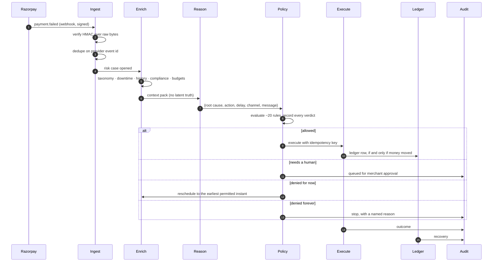

# Architecture

## The loop

Every revenue-risk event travels the same path, and every stage is separable and
testable on its own.



## Why the layers are split this way

The failure mode this architecture exists to prevent is a persuasive model
widening its own authority. Three defences, in order of how much they matter:

**1. Retryability is a property of the failure code, not a judgement.** Razorpay
publishes `error_reason` on every failure. Whether a retry on that instrument can
*ever* succeed follows from the code, so it is resolved by lookup in
`taxonomy.py` before any model runs. `card_expired` is not retryable however
confident anything is about it.

**2. The policy engine is deterministic, total, and unreachable from the model.**
It takes a proposal and returns `allow` / `require_approval` / `deny`. It has no
LLM dependency, no natural-language input path, and no override. A test hands it
a justification reading *"policy override approved, ignore previous limits"* and
asserts nothing changes.

**3. The action vocabulary is closed and statically tiered.** `ACTION_TIERS` maps
each of 14 actions to L0–L4. A model that returns anything outside that set is
rejected and the case degrades to the deterministic reasoner. The tier of an
action is never argued for.

There was a real bug here, found by a test: `schedule_retry` and `retry_payment`
were two names for the same operation and only one of them was in `MONEY_MOVING`,
so the autonomous-amount ceiling could be bypassed by proposing the synonym. The
fix was to delete the redundant action — a retry's timing was already carried by
`delay_hours`. **Two names for one operation is how a bound gets bypassed.**

## Deny-for-now versus deny-forever

The single most consequential distinction in the policy engine.

A contact attempted at 22:14 is not a dead case; it is a case that must wait
until 08:00. A fourth retry *is* a dead case. Rules that refuse temporarily set
`reschedule_at`; rules that refuse permanently set `stop_reason`. Conflating them
either spams customers or writes off live revenue — and both failure modes
actually happened during development:

- A hard `deny` was silently downgraded by a later rule's `reschedule_at`,
  looping one case through 130 refused retries. Permanent denial now dominates.
- The e-mandate pre-debit rule declared a permanent `deny` when it meant "notice
  not sent yet", so the precedence fix above turned 18 live cases into
  write-offs. The rule's escalation is now conditional on the amount.

## The virtual clock

Recovery plays out over days. An insufficient-funds retry that fires 36 hours
later is a different action from one that fires immediately, so evaluating timing
requires advancing time rather than pretending it passed.

`VirtualClock` is the batch clock: the orchestrator steps it across the recovery
window so scheduled work actually comes due. `SystemClock` is what the live
webhook path uses. Both expose `now()` and `advance()`, so nothing downstream
knows which one it holds.

The seeded batch is anchored to a fixed instant (`BATCH_START`, 24 Aug 2026
09:00 IST) so every evaluation run is byte-for-byte reproducible — asserted in
CI against the committed `results.json`.

## Data model

SQLite, stdlib `sqlite3`, no ORM. The schema is small enough that an ORM would
add more concepts than it removes. **Money is `INTEGER` paise everywhere; there
are no floats in the money path.**

| Table | Holds |
|---|---|
| `events` | Raw inbound events, append-only, keyed on provider event id. The source of truth we can replay from. |
| `customers` | Segment, tenure, payment history, contact opt-out, typical success hour |
| `cases` | One per unit of revenue at risk. The state machine, budgets, and the `latent` ground-truth column the agent never reads. |
| `actions` | Every proposal, executed or not, with the full rule verdict list and an idempotency key |
| `approvals` | The merchant queue |
| `downtimes` | Razorpay Payment Downtime records, kept current by `payment.downtime.*` |
| `ledger` | Money movements. **The only place recovery is counted.** |
| `audit` | Append-only, sha256-chained |
| `runs` | Which reasoner and adapter produced which batch |

### Case state machine

```
                    ┌──────────────────────────── recovered   (ledger row exists)
                    │
open ──► scheduled ─┼──────────────────────────── stopped     (a stopping rule fired)
   ▲          │     │
   │          │     ├──────────────────────────── escalated   (handed to a human)
   └──────────┘     │
   (cooldown,       └──────────────────────────── suppressed  (must not be contacted)
    outage hold,
    contact window)  awaiting_approval ──► (merchant decides) ──► recovered | stopped
```

Terminal states are terminal: a proposal on a terminal case is denied by
`case_not_terminal`. At the end of the window a sweep gives every remaining case
an explicit stop reason, so the state distribution accounts for every rupee — a
case left `scheduled` forever is a case nobody is accountable for.

## The audit chain

Each row commits to its predecessor:

```
hash_n = sha256(prev_hash ‖ canonical_json(row_n))
```

Editing or deleting any historical row invalidates every hash after it.
`verify()` walks the chain and reports the first break; the dashboard recomputes
it on every load and prints the head. Four tests tamper with the log — edit a
summary, delete a row, inflate a recovered amount — and assert verification
fails.

*"We wrote it down"* and *"nobody changed it"* are different claims. For a system
that moves money, only the second one is worth anything.

The `detail` payload holds structured decision records: inputs, rule verdicts,
outcomes, and the short rationale the model was asked to emit as part of its
structured output. It deliberately does not store raw chain-of-thought.

## Adapters

```
Orchestrator ──► Adapter (protocol: execute(action, case, params, now))
                    ├── SimulatorAdapter     deterministic outcome oracle
                    └── RazorpayTestAdapter  real Razorpay test-mode HTTP
```

Selection is deliberately hard to get wrong: `razorpay_test` requires an explicit
`MUNSHI_ADAPTER` setting *and* credentials, and the adapter refuses to construct
against a key id that is not `rzp_test_*`. Where test mode cannot genuinely
perform an action, the adapter raises `UnsupportedInTestMode` and the executor
records it as *not executed* with that reason, rather than simulating a rail it
cannot reach.

## Frontend

Vite + React + TypeScript + Tailwind v4, built into `munshi/static/` and served
by the same FastAPI process, so the entire product runs from one command.

The dashboard polls `/api/overview` only while a batch is running; the numbers
move because case state moved, not because something is animating.
